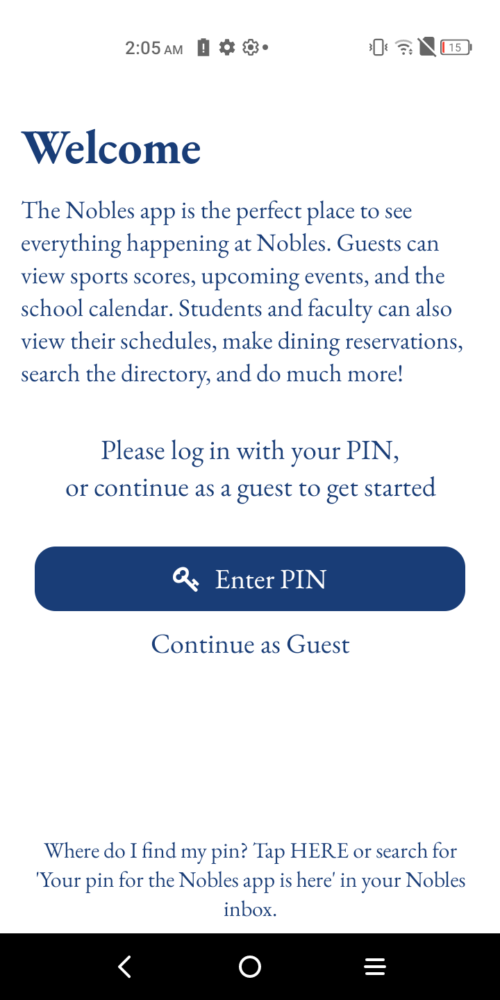
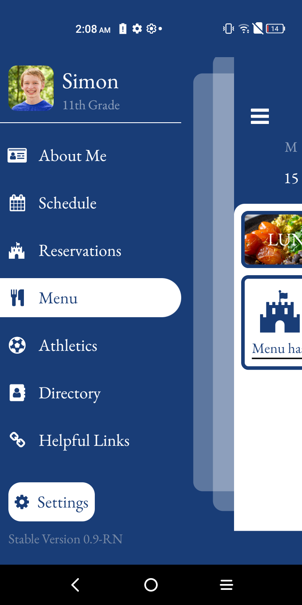
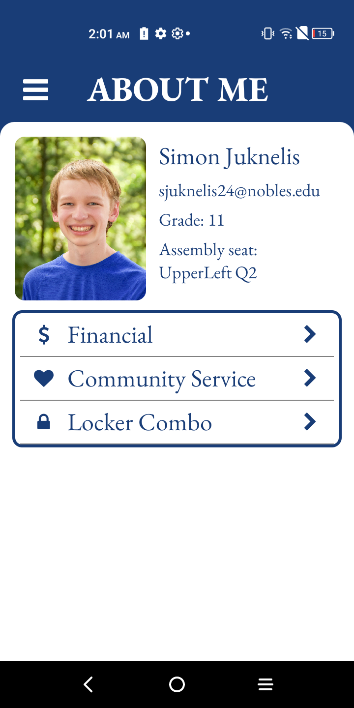
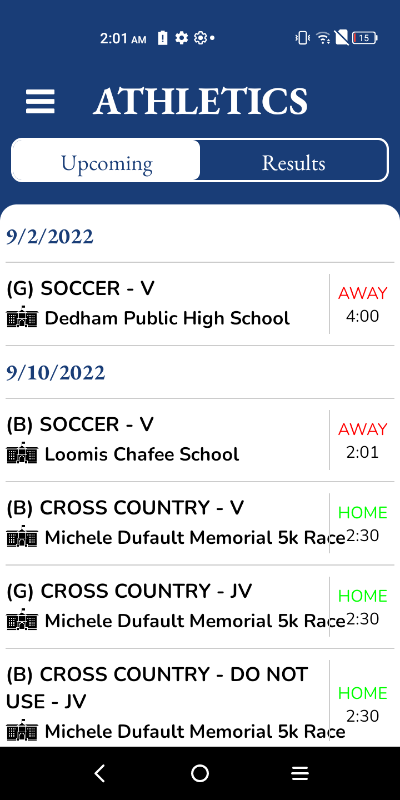
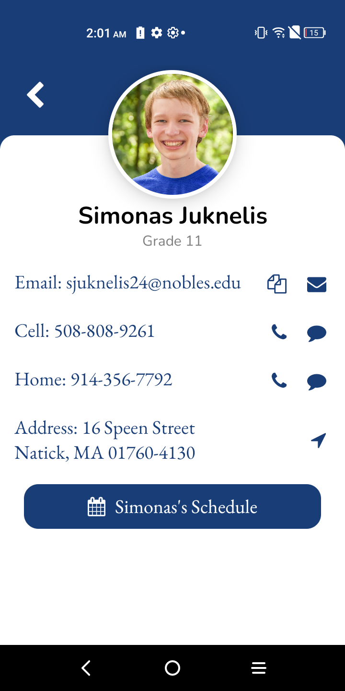
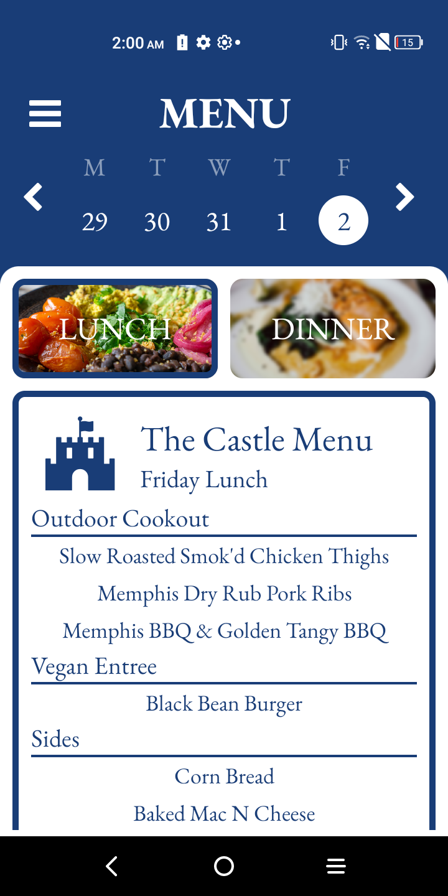
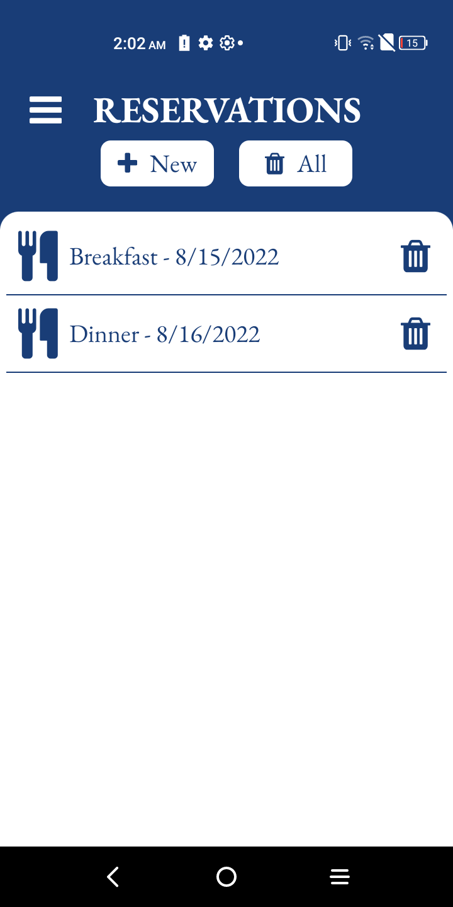

# Nobles App React Native

   
   
   
   
   
   
   

## How to run (I think)
1. Install Node.js and NPM
2. Run `npm i -g expo-cli`
3. `cd` to this folder and run `expo start` (or `npx expo start --no-dev --minify` for better performance)
4. Download Expo Go on your phone and scan the QR code, or type `i` or `a` for iOS or Android simulators